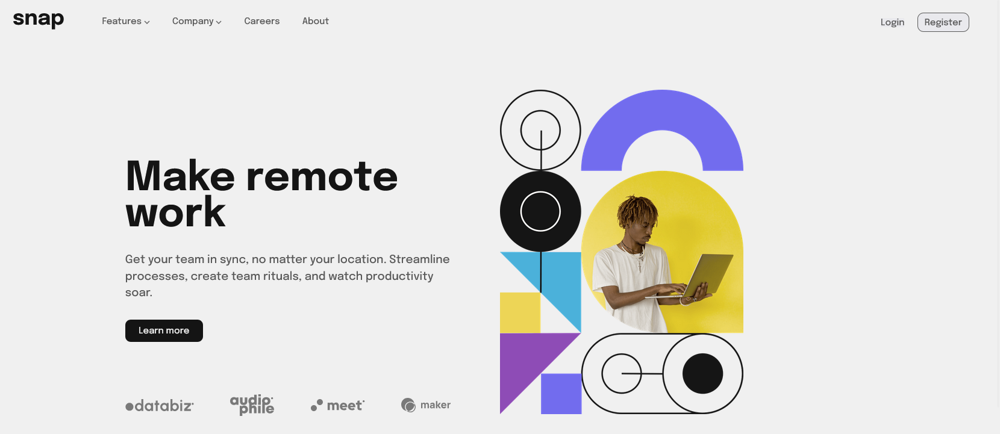

# Snap - Modern hero section with responsive navigation



## Resources

This project is a solution to the [Intro section with dropdown navigation](https://www.frontendmentor.io/challenges/intro-section-with-dropdown-navigation-ryaPetHE5) from Frontend Mentors.

## Built with

- HTML
- CSS
- JavaScript
- Cypress
- AI Support :)

## How to run

The application is deployed in netlify service so you can open it by open the link:
[Snap app on Netlify](https://snap-kwlodarczyk.netlify.app/)

Alternative way is installing this repo and run index.html.

## Key Features

This project focuses on providing a seamless and responsive user experience, particularly with its navigation. It features:

**Responsive Navigation:** The layout adapts smoothly across different devices, ensuring optimal viewing on both desktop and mobile screens.

**Interactive Dropdown Menus:** Intuitive dropdowns for the "Features" and "Company" sections enhance user experience by organizing content cleanly on the desktop view.

**Mobile Menu:** On smaller screens, the navigation transforms into a clean, easy-to-use hamburger menu with an accompanying overlay for better focus and usability.

## Tests

I have automated key functionalities of the project's user interface. My tests cover core interactions, including dropdown menu behavior and responsive display of elements on mobile devices.

- **Location**: `/cypress/e2e/spec.cy.js`

- **How to run automated tests**:

From the root of the project open cmd and write the prompt:

```bash
npm install
npx cypress run
```
